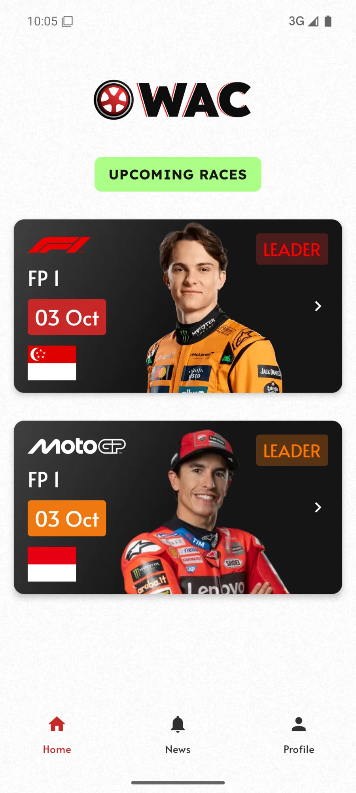
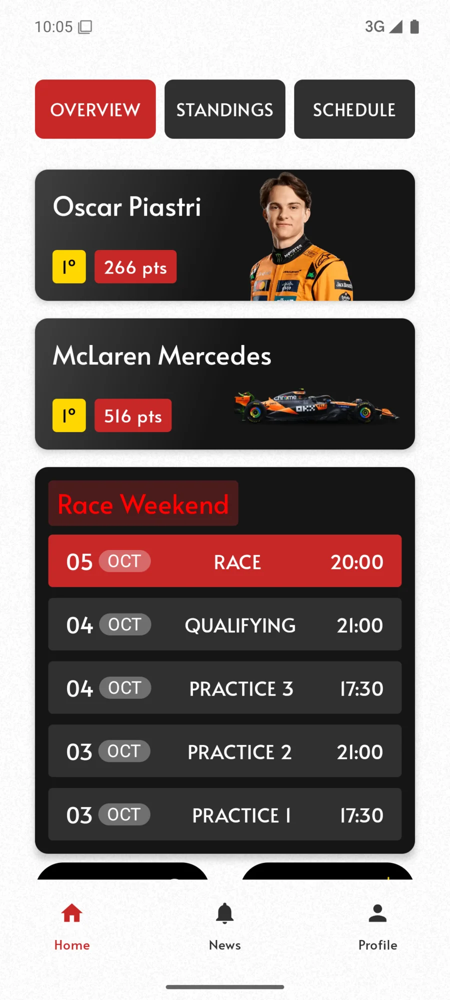
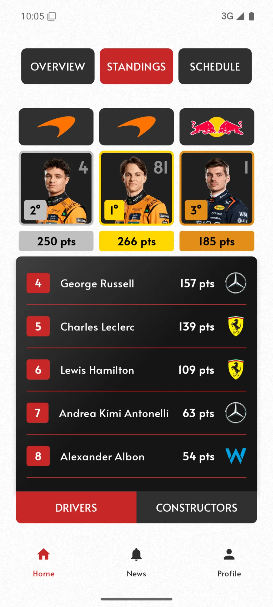
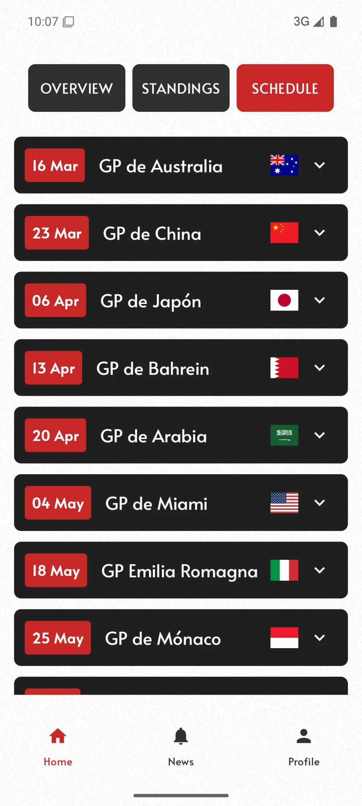

# 🏁 WAC — We Are Checking


-3DDC84?logo=android&logoColor=white)

**WAC (We Are Checking)** es una aplicación Android para seguir los principales campeonatos de deportes de motor — **Fórmula 1**, **MotoGP** e **IndyCar**, sus calendarios, clasificaciones, información de circuitos, meteorología de la carrera y noticias. Incluye autenticación de usuarios y notificaciones push configurables por categoría.

> 🎓 Proyecto de **Fin de Ciclo de Formación Profesional (FP)**.

---

## 📱 Capturas

| Inicio de sesión | Inicio · Próximas carreras | F1 · Resumen |
|:---:|:---:|:---:|
|  |  |  |

| F1 · Clasificación | F1 · Calendario |
|:---:|:---:|
|  |  |

---

## ✨ Funcionalidades

- 🔐 **Autenticación** con Firebase: registro e inicio de sesión por email/contraseña y con **Google Sign-In**, verificación de correo y recuperación de contraseña.
- 🏎️ **Próximas carreras** en la pantalla de inicio para F1 y MotoGP.
- 📅 **Detalle por categoría** (F1 / MotoGP / IndyCar) con tres pestañas:
  - **Overview** — líder del mundial, equipo líder y fin de semana de carrera.
  - **Standings** — clasificación de **pilotos** y **constructores**.
  - **Schedule** — sesiones del Gran Premio (libres, clasificación, sprint, carrera).
- 🌦️ **Meteorología** del Gran Premio (condiciones y temperatura de carrera/clasificación).
- 📰 **Noticias** del mundo del motor (API de NewsAPI).
- 🔔 **Notificaciones push** con preferencias por categoría, enviadas mediante **Cloud Functions** programadas.
- 👤 **Perfil** de usuario y cierre de sesión.

---

## 🧱 Stack tecnológico

| Área | Tecnología |
|---|---|
| **Lenguaje** | Kotlin |
| **UI** | Jetpack Compose + Material 3 · diseño adaptativo · tipografía Lexend Deca |
| **Arquitectura** | MVVM + Repository · Hilt (DI) · Coroutines / Flow |
| **Backend** | Firebase: Authentication · Cloud Firestore · Cloud Messaging (FCM) · Analytics |
| **Red** | Retrofit + Moshi/Gson · Coil (carga de imágenes) |
| **APIs externas** | [Open-Meteo](https://open-meteo.com) (meteorología) · [NewsAPI](https://newsapi.org) (noticias) |
| **Cloud Functions** | Node.js 22 (notificaciones programadas) |
| **Build** | Gradle KTS + Version Catalog · AGP 8.10 · `minSdk 34` / `targetSdk 35` |

---

## 🏗️ Arquitectura

El proyecto sigue el patrón **MVVM** con una capa de **repositorios**, inyección de dependencias con **Hilt** y una UI 100 % **Jetpack Compose**.

```
app/src/main/java/com/emi/wac/
├── common/         # Constantes y utilidades comunes
├── data/
│   ├── model/      # Modelos de dominio (auth, circuit, drivers, sessions, news, weather…)
│   ├── network/    # Clientes y servicios Retrofit (NewsAPI, Open-Meteo) y FCM
│   └── repository/ # Repositorios (Auth, Racing, Standings, Weather, News, UserPreferences)
├── di/             # Módulos de Hilt
├── ui/
│   ├── components/ # Componentes Compose reutilizables
│   ├── screens/    # Pantallas (login, registro, home, perfil, detalle de categoría…)
│   └── theme/      # Tema, colores y tipografías
├── viewmodel/      # ViewModels por pantalla (estado con Flow)
└── utils/          # Utilidades (fechas, JSON, navegación, etc.)

functions/          # Cloud Functions (Node.js) para notificaciones programadas
```

---

## 🚀 Ejecutar el proyecto

### Requisitos
- **JDK 17+**
- **Android SDK** (o Android Studio) con la **API 35**
- Emulador o dispositivo **Android 14+** (`minSdk 34`)

### Configuración
1. Coloca el archivo **`app/google-services.json`** de tu proyecto de Firebase (no se incluye en el repositorio por seguridad).
2. Crea **`local.properties`** en la raíz con la ruta del SDK y, opcionalmente, la clave de noticias:
   ```properties
   sdk.dir=/ruta/a/Android/Sdk
   news.api.key=TU_API_KEY_DE_NEWSAPI
   ```
3. Compila e instala:
   ```bash
   ./gradlew :app:installDebug
   ```
   O usando el script de ayuda (arranca el emulador si es necesario, compila, instala y abre la app):
   ```bash
   ./run.sh
   ```

---

## 👤 Autor

**Emilio** — [@emil-011](https://github.com/emil-011)

Proyecto de Fin de Ciclo de Formación Profesional.
